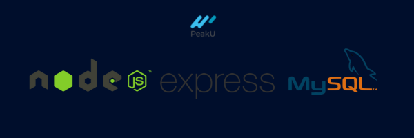

# PeakU Bootcamp FullStack Proyecto Final - **Backend**

### Esta aplicación backend fue realizada como proyecto final para el bootcamp de PeakU en donde se recrea el diseño de un landing page de viajes para una empresa de nombre Trabook.

<br />

## Tecnologías usadas:

- ## [Node JS](https://nodejs.org/en)

  Se uso para este proyecto de Backend Node JS, como tecnologia base debido al tamaño de la aplicacion y teniendo en cuenta que ya estoy familiarizado con JavaScript, Node Js es una excelente opcion por su eficiencia, simplicidad, rendimiento, escalabilidad y facilidad de uso.

- ## [Express JS](https://expressjs.com/)

  En esta ocacion se uso como una capa extra Express JS, esto debido a que expande de una manera sencilla las funciones basicas de Node JS para crear un Rest Server de manera eficiemte simplificando la creacion de una API Rest.

- ## [MySQL](https://www.mysql.com/)

  Se uso como base de datos relacional a MySQL, por su robustez, fiabilidad y estabilidad.

- ## [Sequelize](https://sequelize.org/)

  Se implemento Sequelize como ORM, ya que es el mas popular para aplicaciones de Node JS con Base de datos relacionales y es muy sencillo de implementar gracias a su documentacion.

<br />

## Pasos para ejecutar el proyecto de manera local en su equipo:

1. Descargar o clonar el proyecto desde GitHub.

2. Instalar las dependencias de Node necesarias a traves del comando:

   ```
   npm install
   ```

3. Contar con MySQL, MySQL Workbench instalado en el equipo donde se desea ejecutar la aplicacion de manera local

4. Con ayuda de MySQL Workbench, Table Plus o similares crear una base de datos llamada **trabook**

5. Agregar en las variables de entorno del archivo .env.template (eliminar .template) su **usuario**, su **Password** y el **Host** de MySQL por defecto en donde se ejecutara la aplicacion, se recomienda trabajar con el puerto 4000:

   ```
   PORT=4000
   SQL_USER=''
   SQL_PASSWORD=''
   SQL_HOST=''
   ```

6. Ejecutar el siguiente comando para correr en tiempo real de manera local la aplicacion de Node JS:

   ```
   nodemon
   ```

7. Ejecutar el sigueinte comando para crear las tablas respectivas en la base de datos y cargar la informacion de prueba

   ```
   node seed.js
   ```

8. Verificar en la base de datos que se haya cargado la informacion correctamente.

9. Verficiar en el frontend la correcta visualizacion de la data de cada uno de los endpoints.

10. Si se desea verficiar del CRUD de cada uno de los endpoints comparto a continuacion la documentacion de Postman de este proyecto:

    [Proyecto en Postman](https://documenter.getpostman.com/view/20813825/2s93mATKqh)
